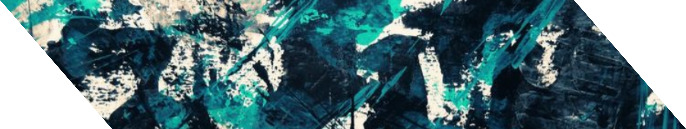

  

# I love frontend development especially the **UI Design**. Creator of projects [Artis.js](https://artisjs.netlify.app), [Knott.js](https://knottjs.netlify.app), and [Weavv](https://weavvcss.netlify.app).

  
  &nbsp;&nbsp;&nbsp;&nbsp;
  
  &nbsp;&nbsp;&nbsp;&nbsp;
  
  &nbsp;&nbsp;&nbsp;&nbsp;&nbsp;
  

---

> [Personal Website](https://louislow81.netlify.app) is currently refactoring.