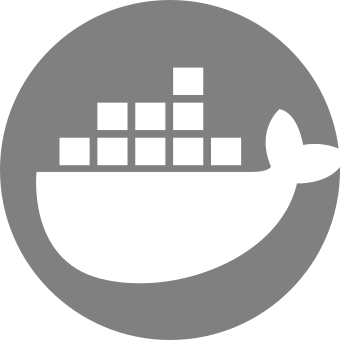
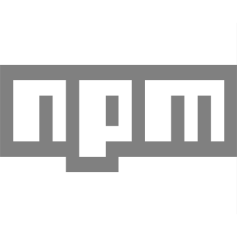
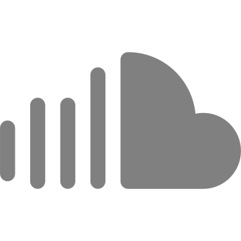

##### I make `UI/UX Designs` and `Frontend-Dev` for Embedded Applications, Web Apps, Websites, TV Apps, Mobile Apps, and as well as Graphic Designs to create materials for marketing and user interface.

  
  &nbsp;&nbsp;&nbsp;
  
  &nbsp;&nbsp;&nbsp;
  
  &nbsp;&nbsp;&nbsp;
  
  &nbsp;&nbsp;&nbsp;
  
  &nbsp;&nbsp;&nbsp;
  
  &nbsp;&nbsp;&nbsp;
  
  &nbsp;&nbsp;&nbsp;
  
  &nbsp;&nbsp;&nbsp;
  

