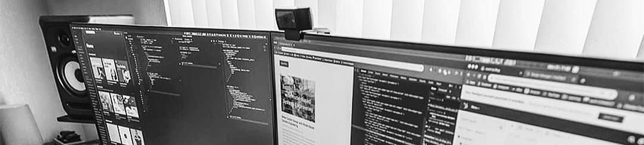

##### I have worked in an embedded system domain for ten years. I am primarily prototyping `Electronic applications` for Automation, Monitoring and Signal Processing. I also make `UI/UX Designs` and `Frontend-Dev` for Embedded Applications, Web Apps, Websites, TV Apps, Mobile Apps, and as well as Graphic Designs to create materials for marketing and user interface.

 &nbsp;&nbsp;&nbsp;  &nbsp;&nbsp;&nbsp;  &nbsp;&nbsp;&nbsp;  &nbsp;&nbsp;&nbsp;  &nbsp;&nbsp;&nbsp;  &nbsp;&nbsp;&nbsp;  &nbsp;&nbsp;&nbsp; 
